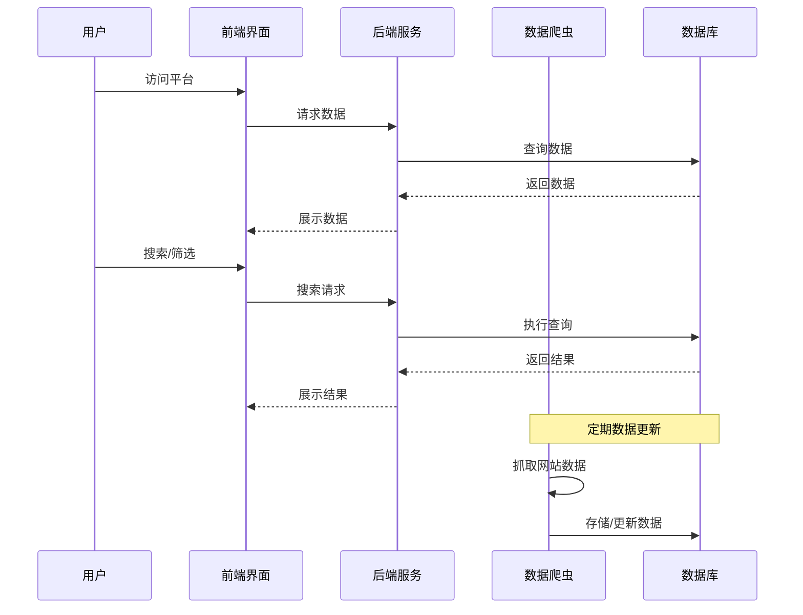

# 农用杀螨剂信息平台 - 产品需求文档

## 1. 产品路线图 (Product Roadmap)

### 核心目标 (Mission)
构建一个全面、实时的农用杀螨剂信息平台，为农户、农资经销商和科研人员提供精准的数据支持和决策参考。

### 用户画像 (Persona)
1. **农户**：
   - 痛点：缺乏专业知识，难以选择适合自己种植作物的杀螨剂；对产品效果和安全性担忧；价格敏感性高。
2. **农资经销商**：
   - 痛点：需要了解市场趋势和竞争产品信息；库存管理和采购决策需要数据支持；需要向客户提供专业建议。
3. **科研人员**：
   - 痛点：需要大量数据进行研究分析；难以获取全面的产品信息和登记数据；需要了解最新的杀螨剂研发动态。

### V1: 最小可行产品 (MVP)
1. **核心数据抓取**：
   - 抓取国内主要农药登记网站的杀螨剂基础信息
   - 数据包括：产品名称、有效成分、登记号、生产企业、防治对象
2. **基础搜索功能**：
   - 按作物类型、螨虫种类、有效成分搜索杀螨剂
   - 简单的筛选和排序功能
3. **产品详情页**：
   - 展示杀螨剂的详细信息
   - 基础的产品对比功能
4. **用户权限管理**：
   - 区分农户、经销商、科研人员三种角色
   - 基础的注册和登录功能
5. **数据可视化**：
   - 简单的市场分布图表
   - 基础的产品使用统计

### V2 及以后版本 (Future Releases)
1. **高级数据抓取**：
   - 扩展到国际数据库和学术文献
   - 抓取价格信息和市场动态
   - 实时监控产品安全性和召回信息
2. **智能推荐系统**：
   - 基于用户种植作物和螨虫类型的个性化推荐
   - 考虑地域、气候等因素的智能匹配
3. **市场分析工具**：
   - 深度的市场趋势分析
   - 竞争对手分析和价格监控
   - 预测性市场需求分析
4. **科研支持功能**：
   - 数据导出和API接口
   - 文献引用和研究趋势分析
   - 实验数据管理和对比工具
5. **社区互动**：
   - 用户评价和使用经验分享
   - 专家问答和技术支持
   - 行业新闻和技术动态

### 关键业务逻辑 (Business Rules)
1. **数据更新频率**：基础数据每周更新一次，市场价格数据每日更新
2. **用户权限**：
   - 农户：可查看产品信息和基础推荐
   - 经销商：可查看市场分析和价格数据
   - 科研人员：可访问全部数据和导出功能
3. **数据来源**：优先从官方登记网站获取数据，确保数据准确性
4. **搜索逻辑**：支持模糊搜索和多条件组合搜索
5. **推荐算法**：基于作物类型、螨虫种类、地域适应性等因素

### 数据契约 (Data Contract)
1. **产品基础信息**：
   - 产品ID、名称、有效成分、含量、登记号、生产企业、防治对象、适用作物
2. **用户信息**：
   - 用户ID、角色、注册信息、偏好设置
3. **市场数据**：
   - 价格信息、销量数据、市场份额、地区分布
4. **使用反馈**：
   - 用户评价、使用效果、不良反应

## 2. MVP原型设计

### 设计理念1：简洁实用型
```
+---------------------------------------------+
|             农用杀螨剂信息平台              |
+---------------------------------------------+
| 搜索框: [作物类型] [螨虫种类] [有效成分] [搜索] |
+---------------------------------------------+
| 筛选: [价格范围] [效果评级] [适用地区]       |
+---------------------------------------------+
| 结果列表:                                   |
| 1. 产品名称 - 有效成分 - 生产企业 - 登记号  |
| 2. 产品名称 - 有效成分 - 生产企业 - 登记号  |
| 3. 产品名称 - 有效成分 - 生产企业 - 登记号  |
+---------------------------------------------+
| 数据统计: [市场分布] [使用情况]              |
+---------------------------------------------+
```

### 设计理念2：分类导航型
```
+---------------------------------------------+
|             农用杀螨剂信息平台              |
+-------------------+-------------------------+
| 导航菜单:         | 内容区域                |
| - 首页            | +---------------------+ |
| - 产品库          | | 搜索框              | |
| - 市场分析        | +---------------------+ |
| - 我的账户        | | 推荐产品            | |
+-------------------+ |                     | |
|                   | | 产品列表            | |
|                   | +---------------------+ |
|                   | | 数据图表            | |
|                   | +---------------------+ |
+-------------------+-------------------------+
```

### 设计理念3：角色定制型
```
+---------------------------------------------+
|             农用杀螨剂信息平台              |
+---------------------------------------------+
| 角色切换: [农户] [经销商] [科研人员]         |
+---------------------------------------------+
| 个性化仪表盘:                               |
| - 农户: 推荐产品、使用指南、价格比较        |
| - 经销商: 市场趋势、库存建议、竞争分析      |
| - 科研人员: 数据导出、文献参考、研究工具    |
+---------------------------------------------+
| 快速搜索: [搜索框] [高级筛选]               |
+---------------------------------------------+
| 最近浏览:                                   |
| 1. 产品名称 - 上次查看时间                  |
| 2. 产品名称 - 上次查看时间                  |
+---------------------------------------------+
```

## 3. 架构设计蓝图

### 核心流程图



### 组件交互说明

1. **前端组件**：
   - 搜索组件：与后端API交互，发送搜索请求
   - 筛选组件：与后端API交互，发送筛选条件
   - 数据展示组件：接收后端数据并展示
   - 用户认证组件：处理注册、登录逻辑

2. **后端组件**：
   - API服务：处理前端请求
   - 数据处理服务：处理爬虫数据
   - 用户管理服务：处理用户权限
   - 搜索服务：处理搜索和筛选逻辑

3. **数据层**：
   - 爬虫模块：抓取外部数据
   - 数据库：存储产品信息和用户数据
   - 缓存：提高查询性能

### 技术选型与风险

1. **前端技术**：
   - React/Vue.js：构建用户界面
   - Ant Design/Element UI：UI组件库
   - ECharts：数据可视化

2. **后端技术**：
   - Node.js/Python：构建API服务
   - Express/FastAPI：Web框架
   - MongoDB/PostgreSQL：数据库

3. **爬虫技术**：
   - Scrapy：专业爬虫框架
   - Selenium：处理动态网页
   - BeautifulSoup：解析HTML

4. **潜在风险**：
   - 网站反爬措施：可能导致爬虫被封禁
   - 数据更新频率：需要平衡实时性和服务器负载
   - 用户隐私：需要确保用户数据安全
   - 数据准确性：需要定期验证数据质量

5. **风险缓解策略**：
   - 爬虫代理：使用多个IP地址
   - 限速策略：控制爬虫请求频率
   - 数据验证：定期与官方数据对比
   - 加密存储：保护用户敏感信息

## 4. 最终确认

本产品需求文档基于MVP版本的核心功能，涵盖了产品路线图、原型设计和架构蓝图。文档将作为产品开发的基础，确保开发团队能够清晰理解产品需求和技术架构。

在后续开发过程中，我们将根据用户反馈和市场需求，不断迭代和完善产品功能，逐步实现V2及以后版本的特性。