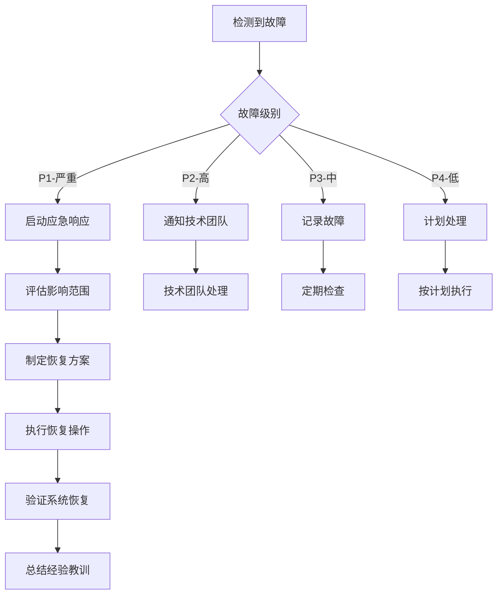

# 灾备策略
# 苏顺植保网站 - 灾难恢复
# 版本: 1.0.0

## 概述

本文档描述了苏顺植保项目的灾备策略，确保在灾难发生时能够快速恢复服务。

---

## 1. 灾备等级定义

### 1.1 RTO 和 RPO

| 灾备等级 | RTO (恢复时间目标) | RPO (恢复点目标) | 成本 | 适用场景 |
|-----------|-------------------|-------------------|------|----------|
| **等级1 - 冷备** | 24-48小时 | 24小时 | 低 | 非关键业务 |
| **等级2 - 温备** | 4-12小时 | 1-4小时 | 中 | 重要业务 |
| **等级3 - 热备** | 1-4小时 | 15分钟-1小时 | 高 | 关键业务 |
| **等级4 - 实时备** | < 1小时 | < 15分钟 | 很高 | 核心业务 |

**苏顺植保推荐等级**: 等级3 - 热备

---

## 2. 数据备份策略

### 2.1 数据库备份

#### 自动备份脚本

```bash
#!/bin/bash
# scripts/backup-database.sh

# 配置
BACKUP_DIR="/var/backups/database"
RETENTION_DAYS=30
DB_HOST="your-db-host"
DB_USER="your-db-user"
DB_PASSWORD="your-db-password"
DB_NAME="sushun_production"
S3_BUCKET="sushun-backups"
S3_REGION="oss-cn-hangzhou"

# 创建备份目录
mkdir -p "$BACKUP_DIR"

# 生成备份文件名
BACKUP_FILE="sushun_db_$(date +%Y%m%d_%H%M%S).sql.gz"
BACKUP_PATH="$BACKUP_DIR/$BACKUP_FILE"

# 执行数据库备份
echo "🔄 开始数据库备份..."
mysqldump -h "$DB_HOST" -u "$DB_USER" -p"$DB_PASSWORD" \
  --single-transaction \
  --quick \
  --lock-tables=false \
  --routines \
  --triggers \
  --events \
  "$DB_NAME" | gzip > "$BACKUP_PATH"

if [ $? -eq 0 ]; then
  echo "✅ 数据库备份成功: $BACKUP_FILE"
  
  # 上传到对象存储
  echo "📤 上传备份到对象存储..."
  aws s3 cp "$BACKUP_PATH" "s3://$S3_BUCKET/database/$BACKUP_FILE" \
    --region "$S3_REGION"
  
  if [ $? -eq 0 ]; then
    echo "✅ 备份上传成功"
    
    # 删除本地备份文件
    rm -f "$BACKUP_PATH"
  else
    echo "❌ 备份上传失败"
    exit 1
  fi
else
  echo "❌ 数据库备份失败"
  exit 1
fi

# 清理过期备份
echo "🧹 清理过期备份..."
find "$BACKUP_DIR" -name "*.sql.gz" -mtime +$RETENTION_DAYS -delete
aws s3 ls "s3://$S3_BUCKET/database/" --recursive | \
  awk '{print $4}' | while read file; do
    if [ -n "$file" ]; then
      file_date=$(echo "$file" | grep -oP '\d{8}_\d{6}')
      if [ -n "$file_date" ]; then
        backup_time=$(date -d "${file_date:0:8} ${file_date:9:2}:${file_date:11:2}" +%s)
        current_time=$(date +%s)
        diff_days=$(( (current_time - backup_time) / 86400 ))
        
        if [ $diff_days -gt $RETENTION_DAYS ]; then
          echo "删除过期备份: $file"
          aws s3 rm "s3://$S3_BUCKET/$file" --region "$S3_REGION"
        fi
      fi
    fi
  done

echo "✅ 备份任务完成"
```

#### 备份计划

```cron
# crontab -e

# 每天凌晨2点执行完整备份
0 2 * * * /path/to/scripts/backup-database.sh >> /var/log/backup.log 2>&1

# 每6小时执行增量备份
0 */6 * * * /path/to/scripts/backup-database-incremental.sh >> /var/log/backup.log 2>&1

# 每周日凌晨3点执行归档
0 3 * * 0 /path/to/scripts/archive-backups.sh >> /var/log/backup.log 2>&1
```

### 2.2 文件备份

#### 静态资源备份

```bash
#!/bin/bash
# scripts/backup-files.sh

BACKUP_DIR="/var/backups/files"
RETENTION_DAYS=30
UPLOAD_DIR="/var/www/sushun/uploads"
S3_BUCKET="sushun-backups"

# 创建备份目录
mkdir -p "$BACKUP_DIR"

# 生成备份文件名
BACKUP_FILE="sushun_files_$(date +%Y%m%d_%H%M%S).tar.gz"
BACKUP_PATH="$BACKUP_DIR/$BACKUP_FILE"

# 执行文件备份
echo "🔄 开始文件备份..."
tar -czf "$BACKUP_PATH" -C "$(dirname "$UPLOAD_DIR")" "$(basename "$UPLOAD_DIR")"

if [ $? -eq 0 ]; then
  echo "✅ 文件备份成功: $BACKUP_FILE"
  
  # 上传到对象存储
  echo "📤 上传备份到对象存储..."
  aws s3 cp "$BACKUP_PATH" "s3://$S3_BUCKET/files/$BACKUP_FILE"
  
  if [ $? -eq 0 ]; then
    echo "✅ 备份上传成功"
    rm -f "$BACKUP_PATH"
  else
    echo "❌ 备份上传失败"
    exit 1
  fi
else
  echo "❌ 文件备份失败"
  exit 1
fi

echo "✅ 文件备份任务完成"
```

### 2.3 配置备份

```bash
#!/bin/bash
# scripts/backup-config.sh

BACKUP_DIR="/var/backups/config"
RETENTION_DAYS=90
CONFIG_FILES=(
  "/etc/nginx/nginx.conf"
  "/etc/supervisor/conf.d/sushun.conf"
  "/var/www/sushun/backend/.env.production"
  "/var/www/sushun/backend/ecosystem.config.js"
)

# 创建备份目录
mkdir -p "$BACKUP_DIR"

# 备份配置文件
echo "🔄 开始配置备份..."
for config_file in "${CONFIG_FILES[@]}"; do
  if [ -f "$config_file" ]; then
    filename=$(basename "$config_file")
    backup_path="$BACKUP_DIR/${filename}_$(date +%Y%m%d_%H%M%S)"
    
    cp "$config_file" "$backup_path"
    echo "✅ 已备份: $filename"
  fi
done

# 上传到对象存储
BACKUP_FILE="sushun_config_$(date +%Y%m%d_%H%M%S).tar.gz"
BACKUP_PATH="$BACKUP_DIR/$BACKUP_FILE"
tar -czf "$BACKUP_PATH" -C "$BACKUP_DIR" .

aws s3 cp "$BACKUP_PATH" "s3://sushun-backups/config/$BACKUP_FILE"

echo "✅ 配置备份任务完成"
```

---

## 3. 灾难恢复流程

### 3.1 数据库恢复

```bash
#!/bin/bash
# scripts/restore-database.sh

# 配置
DB_HOST="your-db-host"
DB_USER="your-db-user"
DB_PASSWORD="your-db-password"
DB_NAME="sushun_production"
S3_BUCKET="sushun-backups"
BACKUP_FILE=$1

if [ -z "$BACKUP_FILE" ]; then
  echo "❌ 错误: 请指定备份文件名"
  echo "用法: ./restore-database.sh <backup-file>"
  exit 1
fi

# 下载备份文件
echo "📥 下载备份文件..."
aws s3 cp "s3://$S3_BUCKET/database/$BACKUP_FILE" /tmp/backup.sql.gz

if [ $? -ne 0 ]; then
  echo "❌ 备份文件下载失败"
  exit 1
fi

# 解压备份文件
echo "📦 解压备份文件..."
gunzip -c /tmp/backup.sql.gz > /tmp/backup.sql

# 创建恢复前备份
echo "💾 创建恢复前备份..."
mysqldump -h "$DB_HOST" -u "$DB_USER" -p"$DB_PASSWORD" \
  "$DB_NAME" > "/tmp/pre_restore_$(date +%Y%m%d_%H%M%S).sql"

# 恢复数据库
echo "🔄 恢复数据库..."
mysql -h "$DB_HOST" -u "$DB_USER" -p"$DB_PASSWORD" \
  "$DB_NAME" < /tmp/backup.sql

if [ $? -eq 0 ]; then
  echo "✅ 数据库恢复成功"
  
  # 验证数据
  echo "🔍 验证数据完整性..."
  TABLE_COUNT=$(mysql -h "$DB_HOST" -u "$DB_USER" -p"$DB_PASSWORD" \
    -e "SELECT COUNT(*) FROM information_schema.tables WHERE table_schema = '$DB_NAME'" \
    | tail -n 1)
  
  echo "✅ 数据库包含 $TABLE_COUNT 个表"
  
  # 清理临时文件
  rm -f /tmp/backup.sql.gz /tmp/backup.sql
else
  echo "❌ 数据库恢复失败"
  exit 1
fi

echo "✅ 数据库恢复任务完成"
```

### 3.2 应用恢复

```bash
#!/bin/bash
# scripts/restore-application.sh

BACKUP_VERSION=$1

if [ -z "$BACKUP_VERSION" ]; then
  echo "❌ 错误: 请指定备份版本"
  echo "用法: ./restore-application.sh <backup-version>"
  exit 1
fi

# 停止应用
echo "⏹ 停止应用服务..."
pm2 stop sushun-backend

# 下载备份
echo "📥 下载应用备份..."
aws s3 cp "s3://sushun-backups/app/sushun_$BACKUP_VERSION.tar.gz" /tmp/

# 解压备份
echo "📦 解压备份..."
tar -xzf /tmp/sushun_$BACKUP_VERSION.tar.gz -C /var/www/sushun/

# 安装依赖
echo "📦 安装依赖..."
cd /var/www/sushun/backend
npm ci --only=production

# 恢复环境变量
echo "🔧 恢复环境变量..."
aws s3 cp "s3://sushun-backups/config/.env.production_$BACKUP_VERSION" \
  /var/www/sushun/backend/.env.production

# 启动应用
echo "▶️ 启动应用服务..."
pm2 start sushun-backend

# 验证服务
echo "🔍 验证服务状态..."
sleep 10
pm2 status

echo "✅ 应用恢复任务完成"
```

---

## 4. 高可用架构

### 4.1 多区域部署

```yaml
# k8s/multi-region-deployment.yaml
apiVersion: v1
kind: ConfigMap
metadata:
  name: sushun-config
data:
  PRIMARY_REGION: "cn-hangzhou"
  SECONDARY_REGION: "cn-beijing"
---
apiVersion: apps/v1
kind: Deployment
metadata:
  name: sushun-primary
  namespace: sushun-prod
spec:
  replicas: 3
  selector:
    matchLabels:
      app: sushun
      region: primary
  template:
    metadata:
      labels:
        app: sushun
        region: primary
    spec:
      affinity:
        nodeAffinity:
          requiredDuringSchedulingIgnoredDuringExecution:
            nodeSelectorTerms:
            - matchExpressions:
              - key: region
                operator: In
                values:
                - cn-hangzhou
---
apiVersion: apps/v1
kind: Deployment
metadata:
  name: sushun-secondary
  namespace: sushun-prod
spec:
  replicas: 2
  selector:
    matchLabels:
      app: sushun
      region: secondary
  template:
    metadata:
      labels:
        app: sushun
        region: secondary
    spec:
      affinity:
        nodeAffinity:
          requiredDuringSchedulingIgnoredDuringExecution:
            nodeSelectorTerms:
            - matchExpressions:
              - key: region
                operator: In
                values:
                - cn-beijing
```

### 4.2 数据库主从复制

```sql
-- 主数据库配置
-- /etc/mysql/my.cnf (Master)

[mysqld]
server-id = 1
log-bin = mysql-bin
binlog-format = ROW
binlog-do-db = sushun_production
sync-binlog = 1
```

```sql
-- 从数据库配置
-- /etc/mysql/my.cnf (Slave)

[mysqld]
server-id = 2
relay-log = mysql-relay-bin
read-only = 1
replicate-do-db = sushun_production
```

```bash
# 设置主从复制
# 在从数据库上执行

CHANGE MASTER TO
  MASTER_HOST='master-db-host',
  MASTER_USER='replication-user',
  MASTER_PASSWORD='replication-password',
  MASTER_LOG_FILE='mysql-bin.000001',
  MASTER_LOG_POS=4;

START SLAVE;
```

---

## 5. 故障转移

### 5.1 自动故障转移

```javascript
// scripts/failover.js
const mysql = require('mysql2/promise');
const axios = require('axios');

const PRIMARY_DB = {
  host: process.env.DB_PRIMARY_HOST,
  user: process.env.DB_USER,
  password: process.env.DB_PASSWORD,
  database: process.env.DB_NAME
};

const SECONDARY_DB = {
  host: process.env.DB_SECONDARY_HOST,
  user: process.env.DB_USER,
  password: process.env.DB_PASSWORD,
  database: process.env.DB_NAME
};

async function checkDatabaseHealth(config) {
  try {
    const connection = await mysql.createConnection(config);
    await connection.ping();
    await connection.end();
    return true;
  } catch (error) {
    console.error(`Database health check failed: ${error.message}`);
    return false;
  }
}

async function performFailover() {
  console.log('🔄 开始故障转移...');
  
  // 检查主数据库状态
  const primaryHealthy = await checkDatabaseHealth(PRIMARY_DB);
  
  if (!primaryHealthy) {
    console.log('⚠️  主数据库不可用，执行故障转移');
    
    // 切换到从数据库
    process.env.DB_HOST = SECONDARY_DB.host;
    
    // 通知管理员
    await sendAlert({
      type: 'FAILOVER',
      message: '数据库故障转移已执行',
      severity: 'critical',
      timestamp: new Date().toISOString()
    });
    
    // 更新应用配置
    console.log('✅ 故障转移完成');
  }
}

async function sendAlert(alert) {
  try {
    await axios.post(process.env.ALERT_WEBHOOK, alert);
  } catch (error) {
    console.error('Failed to send alert:', error);
  }
}

// 定期检查
setInterval(async () => {
  await performFailover();
}, 60000); // 每分钟检查一次

module.exports = {
  checkDatabaseHealth,
  performFailover
};
```

### 5.2 手动故障转移

```bash
#!/bin/bash
# scripts/manual-failover.sh

echo "⚠️  警告: 即将执行手动故障转移"
echo "请确认以下操作:"
echo "1. 停止主数据库服务"
echo "2. 提升从数据库为主数据库"
echo "3. 更新应用配置"
echo "4. 重启应用服务"
echo ""
read -p "确认执行故障转移? (yes/no): " confirm

if [ "$confirm" != "yes" ]; then
  echo "❌ 操作已取消"
  exit 1
fi

# 停止主数据库
echo "⏹ 停止主数据库..."
systemctl stop mysql-primary

# 提升从数据库
echo "⬆️ 提升从数据库为主数据库..."
mysql -h "$SECONDARY_DB_HOST" -u "$DB_USER" -p"$DB_PASSWORD" -e "STOP SLAVE; RESET SLAVE ALL;"

# 更新应用配置
echo "🔧 更新应用配置..."
sed -i "s/DB_HOST=.*/DB_HOST=$SECONDARY_DB_HOST/" /var/www/sushun/backend/.env.production

# 重启应用
echo "▶️ 重启应用服务..."
pm2 restart sushun-backend

echo "✅ 手动故障转移完成"
```

---

## 6. 应急响应计划

### 6.1 应急响应团队

| 角色 | 负责人 | 联系方式 | 职责 |
|------|---------|----------|------|
| **应急指挥** | 张三 | 13800138001 | 总体协调和决策 |
| **技术负责人** | 李四 | 13800138002 | 技术问题解决 |
| **数据库管理员** | 王五 | 13800138003 | 数据库恢复 |
| **运维工程师** | 赵六 | 13800138004 | 系统运维 |
| **安全专家** | 钱七 | 13800138005 | 安全事件处理 |

### 6.2 应急响应流程



### 6.3 故障分级

| 级别 | 定义 | 响应时间 | 解决时间 | 通知范围 |
|------|------|----------|----------|
| **P1 - 严重** | 系统完全不可用，影响所有用户 | 15分钟 | 4小时 | 全体用户、管理层 |
| **P2 - 高** | 核心功能不可用，影响大部分用户 | 30分钟 | 8小时 | 受影响用户、管理层 |
| **P3 - 中** | 部分功能不可用，影响部分用户 | 1小时 | 24小时 | 受影响用户 |
| **P4 - 低** | 非核心功能问题，影响少数用户 | 4小时 | 72小时 | 内部团队 |

---

## 7. 演练计划

### 7.1 演练类型

#### 桌面演练
- **频率**: 每季度1次
- **参与人员**: 技术团队
- **演练内容**: 
  - 数据库恢复流程
  - 应用部署流程
  - 配置恢复流程
- **目标**: 验证恢复流程的有效性

#### 功能演练
- **频率**: 每半年1次
- **参与人员**: 全体团队
- **演练内容**:
  - 切换到备用系统
  - 验证数据一致性
  - 测试故障转移
- **目标**: 验证高可用架构

#### 全面演练
- **频率**: 每年1次
- **参与人员**: 全体团队 + 管理层
- **演练内容**:
  - 模拟灾难场景
  - 执行完整恢复流程
  - 评估恢复时间
- **目标**: 验证整体灾备能力

### 7.2 演练评估

```javascript
// scripts/drill-evaluation.js
const drillEvaluation = {
  drillType: '桌面演练',
  date: new Date().toISOString(),
  participants: ['技术团队', '运维团队'],
  
  objectives: [
    '验证数据库恢复流程',
    '验证应用部署流程',
    '验证配置恢复流程'
  ],
  
  results: {
    databaseRestore: {
      objective: '数据库恢复流程',
      status: 'passed',
      duration: '45分钟',
      notes: '恢复流程顺利，符合RTO要求'
    },
    applicationDeploy: {
      objective: '应用部署流程',
      status: 'passed',
      duration: '30分钟',
      notes: '部署流程正常，符合预期'
    },
    configRestore: {
      objective: '配置恢复流程',
      status: 'passed',
      duration: '15分钟',
      notes: '配置恢复快速，无问题'
    }
  },
  
  overallAssessment: {
    status: 'passed',
    rtoAchieved: true,
    rpoAchieved: true,
    recommendations: [
      '增加演练频率',
      '完善监控告警',
      '优化恢复流程'
    ]
  }
};

console.log('演练评估结果:', JSON.stringify(drillEvaluation, null, 2));
```

---

## 8. 监控和告警

### 8.1 灾备监控指标

```javascript
// config/disaster-monitoring.js
const disasterMetrics = {
  // 备份状态
  backupStatus: {
    lastBackupTime: null,
    backupSuccess: true,
    backupRetention: true
  },
  
  // 恢复能力
  recoveryCapability: {
    lastDrillDate: null,
    drillSuccess: true,
    rtoAchieved: true,
    rpoAchieved: true
  },
  
  // 系统可用性
  systemAvailability: {
    primaryRegion: 'available',
    secondaryRegion: 'available',
    databaseReplication: 'active'
  },
  
  // 数据完整性
  dataIntegrity: {
    lastCheckTime: null,
    checksumValid: true,
    dataConsistent: true
  }
};

async function checkDisasterMetrics() {
  console.log('🔍 检查灾备指标...');
  
  // 检查备份状态
  const backupStatus = await checkBackupStatus();
  disasterMetrics.backupStatus = backupStatus;
  
  // 检查恢复能力
  const recoveryCapability = await checkRecoveryCapability();
  disasterMetrics.recoveryCapability = recoveryCapability;
  
  // 检查系统可用性
  const systemAvailability = await checkSystemAvailability();
  disasterMetrics.systemAvailability = systemAvailability;
  
  // 检查数据完整性
  const dataIntegrity = await checkDataIntegrity();
  disasterMetrics.dataIntegrity = dataIntegrity;
  
  // 生成报告
  generateDisasterReport(disasterMetrics);
}

module.exports = {
  disasterMetrics,
  checkDisasterMetrics
};
```

---

## 9. 文档维护

### 9.1 文档更新

- **更新频率**: 每季度
- **更新内容**:
  - 灾备策略变更
  - 演练结果
  - 故障经验
  - 技术升级

### 9.2 培训计划

- **新员工培训**: 入职时
- **定期培训**: 每半年1次
- **培训内容**:
  - 灾备策略说明
  - 恢复流程操作
  - 应急响应流程
  - 演练参与要求

---

## 总结

本灾备策略提供了：

1. ✅ 完整的备份策略（数据库、文件、配置）
2. ✅ 灾难恢复流程（数据库恢复、应用恢复）
3. ✅ 高可用架构（多区域部署、主从复制）
4. ✅ 故障转移机制（自动、手动）
5. ✅ 应急响应计划（团队、流程、分级）
6. ✅ 演练计划（桌面、功能、全面）
7. ✅ 监控和告警（指标、检查）
8. ✅ 文档维护（更新、培训）

通过实施本灾备策略，苏顺植保项目将具备强大的灾难恢复能力，确保业务连续性。
